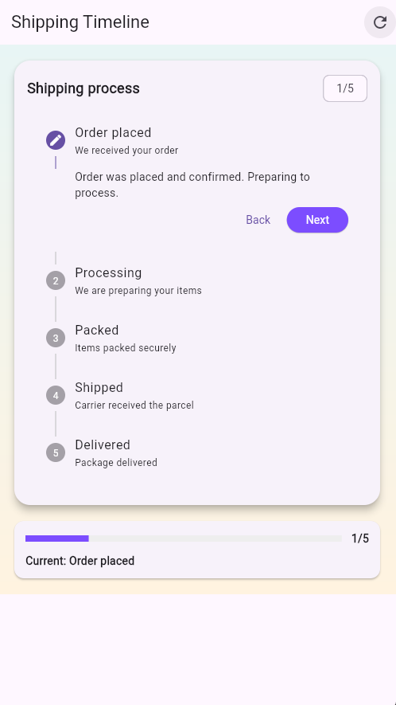
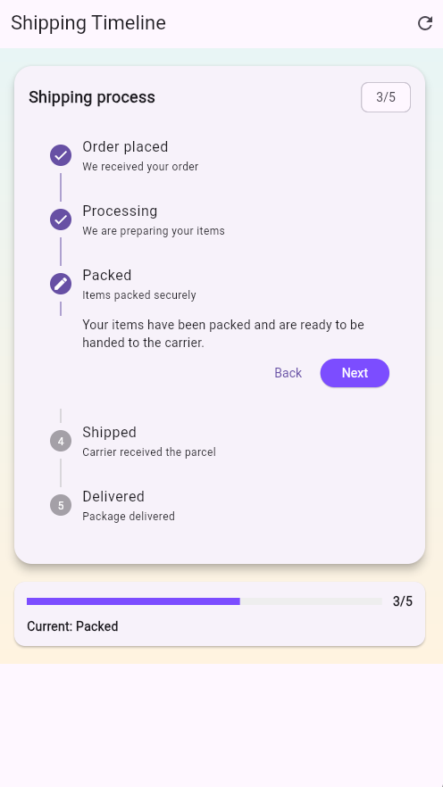

# stepper_widget

A compact demo showing the Material `Stepper` widget used for a 5-step shipping timeline.

Project context
- Purpose: Provide an example screen that shows how to use Flutter's `Stepper` (vertical) for multi-step workflows such as shipping/tracking or onboarding.
- Audience: Developers learning how Stepper works and product/UX reviewers who want a quick interactive prototype.

Key features
- A 5-step shipping timeline (Order placed → Processing → Packed → Shipped → Delivered).
- Interactive Stepper: tap a step to jump, Next/Back/Finish actions wired to explicit move logic.
- Custom-styled controls via `controlsBuilder` and a progress summary bar.

Three attributes to notice
- `currentStep` — controls which step is shown as active.
- `onStepContinue` — called when the Stepper's Next/Finish action is triggered.
- `onStepCancel` — called when the Stepper's Back action is triggered.

Files of interest
- `lib/stepper_demo.dart` — main demo screen implementing the Stepper example.

Run the demo
1. Make sure you have Flutter installed and a device or emulator available.
2. From the project root run:

```powershell
flutter pub get
flutter run
```

Placeholders for screenshots
Add screenshots to the repository (for example in `assets/screenshots/`) and update the paths below. Use PNG or JPG images sized for typical phone screenshots.

- Screenshot: Stepper home (desktop or phone)

  

- Screenshot: Stepper in-progress step

  

Notes
- This demo intentionally keeps logic and UI in the same file for simplicity. If you want a production-ready structure I can extract widgets, add tests, and wire asset images into `pubspec.yaml`.

Commit guidance
- Use meaningful commits for incremental changes (e.g., "add stepper demo screen", "wire stepper controls", "fix layout overflow"). Avoid one giant "final" commit; small, descriptive commits make review easier.

License
- This project is unlicensed; add a LICENSE file if you need one.
